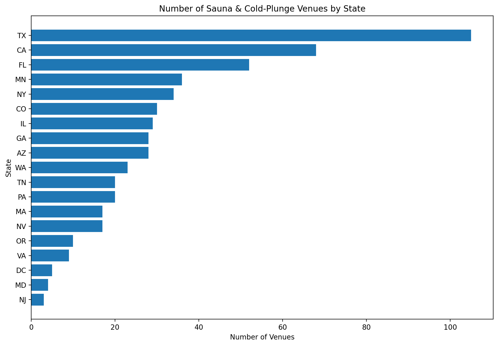
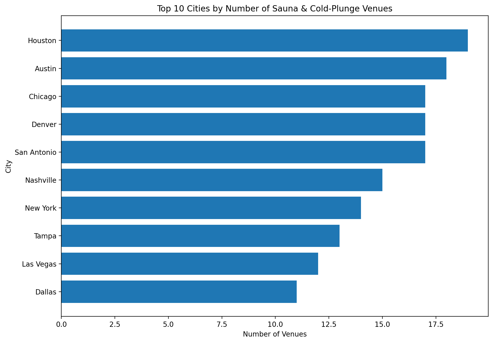
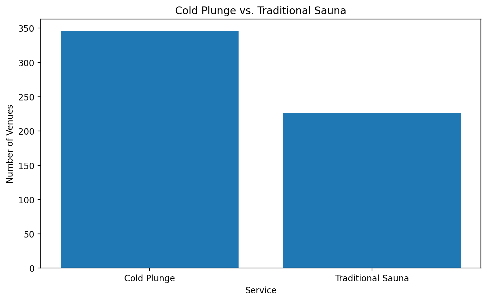
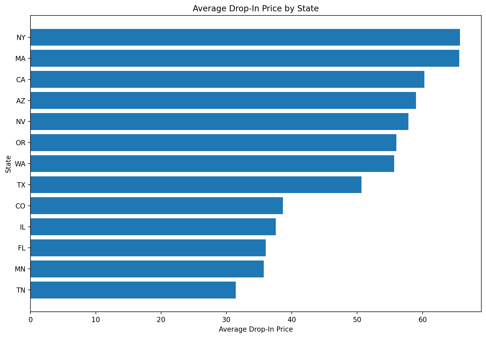

# U.S. Sauna & Cold-Plunge Market Analysis

## Project Overview

This project analyzes the U.S. sauna and cold-plunge market using SQL and Excel. The analysis explores the geographic distribution of wellness venues, service availability, and drop-in pricing patterns across states and cities.

The goal of this project was to practice data cleaning, SQL querying, exploratory data analysis, and data visualization using a real-world dataset.

## Tools Used

- MySQL
- SQL
- Microsoft Excel
- GitHub

## Skills Demonstrated

- Data cleaning
- SQL querying
- Data aggregation
- `COUNT()`
- `AVG()`
- `ROUND()`
- `GROUP BY`
- `HAVING`
- `ORDER BY`
- `LIKE`
- Handling NULL and blank values
- Exploratory data analysis
- Data visualization

## Analysis

This project examines:

1. Number of sauna and cold-plunge venues by state
2. Number of venues by city
3. Cold-plunge vs. traditional sauna availability
4. Average drop-in pricing by state
5. Data-quality issues involving missing and blank pricing values

## Visualizations

### Venues by State

This visualization shows the number of sauna and cold-plunge venues represented in each state in the dataset.

### Top 10 Cities by Number of Venues

This visualization highlights the cities with the largest number of venues in the dataset.

### Cold Plunge vs. Traditional Sauna

This comparison shows the number of venue records containing cold-plunge and traditional-sauna services.

### Average Drop-In Price by State

This visualization shows average drop-in pricing by state after excluding NULL and blank pricing values and limiting the analysis to states with at least five usable price records.

## Key Findings

- Texas had the largest number of venues in the dataset.
- Cold-plunge services appeared in more venue records than traditional sauna services.
- Venue counts varied substantially across states and cities.
- Average drop-in pricing varied across states in the cleaned pricing analysis.
- Data cleaning was necessary because some pricing records contained blank values rather than SQL NULL values.

## Data Source

The dataset was obtained from the public GitHub repository:

https://github.com/findsaunaplunge/data

## Project Files

- **SQL:** Contains the MySQL queries used for the analysis.
- **Excel:** Contains the analysis results and charts.
- **Visualizations:** Contains standalone PNG versions of the charts.

## Project Purpose

This project was created to develop practical skills in SQL and data analytics, including querying, data cleaning, exploratory analysis, and visualization.

## Author

**Christina Hinds**

GitHub: https://github.com/chindsdata
